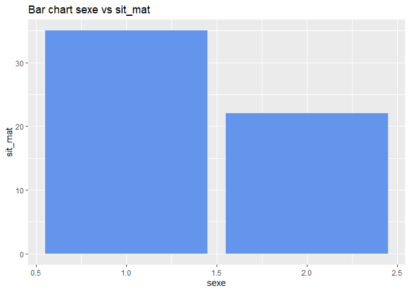
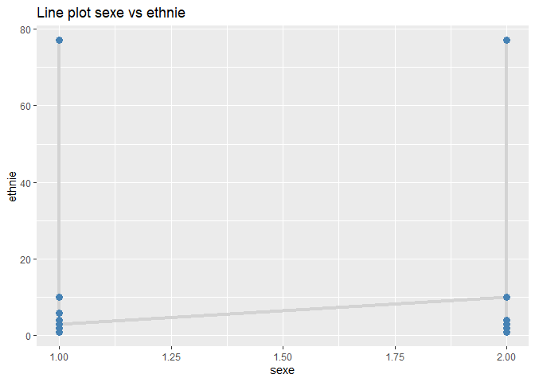
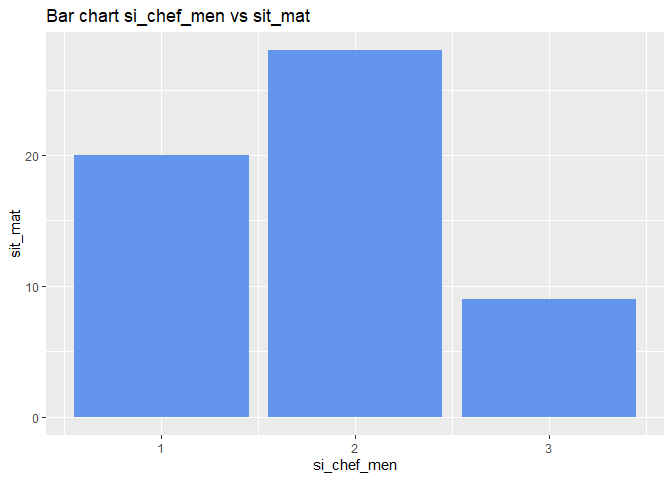

# Résumé
L’objectif de ce projet est d'appliquer les outils que nous avons étudiés pendant le cours du logiciel statistique R, dans le cas d’une étude de cas réelle. Les codes utiliser pour répondre aux questions sont intégrés dans le corps du rapport grâce à R Markdown.


# Importation des packages nécessaires et préparation de l'environnement R


```r
library(dplyr)
library(readxl)
library(here)
library(labelled)
```


```r
rm(list=ls())
```


```r
setwd(dirname(getwd())) # récupère le dossier dans lequel se trouve le script R, prend le dossier parent et le définit comme working directory
c_dir <- getwd()
```


# Recodage et labelisation

## Description de la base

Le fichier Base_Projet.xlsx contient 250 observations et 33 variables.
La première colonne key correspond à l’identifiant de la PME. Les variables sont les suivantes :
<ul>
  <li>sexe: Sexe</li>
  <li>age: Age</li>
  <li>sit_mat: Situation maritale</li>
  <li>si_chef_men: Statut dans le ménage</li>
  <li>ethnie: Ethnie</li>
  <li>occupation: Occupation</li>
  <li>formation: Formation</li>
  <li>niveau_alphabs: Niveau d'alphabétisation</li>
  <li>sup_tot: Quelle est la superficie emblavée en sésame la saison passée ? en hectares</li>
  <li>types_varietes: Quelles sont les variétés que vous utilisez pour la production de sésame ?</li>
  <li>var_trad: Si variétés traditionnelles, donnez les noms</li>
  <li>raison_var_trad: Pourquoi utilisez vous les variétés traditionnelles ?</li>
  <li>var_amel: Si variétés améliorées, laquelle utilisez-vous ?</li>
  <li>raison_var_amel: Pourquoi utilisez vous les variétés améliorées ?</li>
  <li>criteres_var: Quelles sont les critères de choix des variétés de sésame ?</li>
</ul>


## Importation et mise en forme

<ul>
  <li>Importation de la base de données dans un objet de type data.frame nommé base_tp2</li>
  

```r
base_tp2 <- read_excel(paste0(c_dir, "/data/Base TP2.xlsx"))
```
  
  <li>Nombre de lignes (i.e. le nombre de PME) et de colonnes (i.e. nombre de variables) de la base
projet</li>


```r
n_rows <- nrow(base_tp2)
n_cols <- ncol(base_tp2)
cat("Nombre de PME (lignes): ", n_rows, "\n")
```

```
## Nombre de PME (lignes):  53
```

```r
cat("Nombre de variables (colonnes): ", n_cols, "\n")
```

```
## Nombre de variables (colonnes):  30
```

## Recodage et labelisation
  


```r
base_tp2$sexe <- labelled::labelled(
  base_tp2$sexe, 
  c(`Homme` = 1,
    `Femme` = 2))

base_tp2$sit_mat <- labelled::labelled(
  base_tp2$sit_mat, 
  c(`Marié(e)` = 1,
    `Veuf(ve)` = 3,
    `Divorcé(e)` = 4,
    `Séparé(e)` = 5,
    `Célibataire` = 6))

base_tp2$si_chef_men <- labelled::labelled(
  base_tp2$si_chef_men, 
  c(`Femme du chef de ménage` = 1,
    `Chef de ménage` = 2,
    `Fils-fille du chef de ménage` = 3,
    `Autres` = 99))

base_tp2$ethnie <- labelled::labelled(
  base_tp2$ethnie, 
  c(`Wolof` = 1,
    `Pulaar/Toucouleur` = 2,
    `Sérère` = 3,
    `Mandika/Bambara` = 4,
    `Soninké` = 5,
    `Diola` = 6,
    `Manjack` = 7,
    `Bainouk` = 8,
    `Maures` = 9,
    `Balante` = 10,
    `Autre` = 77))

base_tp2$occupation <- labelled::labelled(
  base_tp2$occupation, 
  c(`Agriculture, Elevage, Sylviculture, Pêche` = 1,
    `Activités extractives` = 2,
    `Activités de fabrication (Artisanat)` = 3,
    `Activités de transformation` = 4,
    `Production et distribution d'électricité et de gaz` = 5,
    `Production et distribution d'eau, assainissement, traitement des déchets et dépollution` = 6))

base_tp2$formation <- labelled::labelled(
  base_tp2$formation, 
  c(`Non scolarisé` = 1,
    `Elémentaire` = 2,
    `Moyen` = 3,
    `Secondaire` = 4,
    `Licence` = 5,
    `Master` = 6,
    `Doctorat` = 7,
    `Ne sait pas` = 99))

base_tp2$niveau_alphabs <- labelled::labelled(
  base_tp2$niveau_alphabs, 
  c(`Sans niveau` = 0,
    `Sait lire dans une langue` = 1,
    `Sait lire et écrire dans une langue` = 2))

base_tp2$types_varietes <- labelled::labelled(
  base_tp2$types_varietes, 
  c(`Traditionnelles` = "1",
    `Améliorées` = "2"))

base_tp2$criteres_var <- labelled::labelled(
  base_tp2$criteres_var, 
  c(`Rendements élevés` = "1",
    `Taille des graines` = "2",
    `Résistantes aux maladies/ravageurs` = "3",
    `Tolérantes aux sécheresses` = "4",
    `Tolérantes aux inondations` = "5",
    `Faible charge de travail` = "6",
    `Faibles quantités d'intrants` = "7",
    `Facile à transformer` = "8",
    `Haute teneur en huile` = "9",
    `Haut rendement après transformation` = "10",
    `Demande sur le marché` = "11",
    `Bon gôut` = "12",
    `Belle couleur` = "13",
    `Haut rendement en fourrages` = "14",
    `Qualité du fourrage` = "15",
    `Autres à spécifier` = "16"))
```


```r
#check labels
expss::val_lab(base_tp2$sexe)
```

```
## Homme Femme 
##     1     2
```

```r
expss::val_lab(base_tp2$sit_mat)
```

```
##    Marié(e)    Veuf(ve)  Divorcé(e)   Séparé(e) Célibataire 
##           1           3           4           5           6
```

```r
expss::val_lab(base_tp2$si_chef_men)
```

```
##      Femme du chef de ménage               Chef de ménage 
##                            1                            2 
## Fils-fille du chef de ménage                       Autres 
##                            3                           99
```

```r
expss::val_lab(base_tp2$ethnie)
```

```
##             Wolof Pulaar/Toucouleur            Sérère   Mandika/Bambara 
##                 1                 2                 3                 4 
##           Soninké             Diola           Manjack           Bainouk 
##                 5                 6                 7                 8 
##            Maures           Balante             Autre 
##                 9                10                77
```

```r
expss::val_lab(base_tp2$occupation)
```

```
##                                               Agriculture, Elevage, Sylviculture, Pêche 
##                                                                                       1 
##                                                                   Activités extractives 
##                                                                                       2 
##                                                    Activités de fabrication (Artisanat) 
##                                                                                       3 
##                                                             Activités de transformation 
##                                                                                       4 
##                                      Production et distribution d'électricité et de gaz 
##                                                                                       5 
## Production et distribution d'eau, assainissement, traitement des déchets et dépollution 
##                                                                                       6
```

```r
expss::val_lab(base_tp2$formation)
```

```
## Non scolarisé   Elémentaire         Moyen    Secondaire       Licence 
##             1             2             3             4             5 
##        Master      Doctorat   Ne sait pas 
##             6             7            99
```

```r
expss::val_lab(base_tp2$niveau_alphabs)
```

```
##                         Sans niveau           Sait lire dans une langue 
##                                   0                                   1 
## Sait lire et écrire dans une langue 
##                                   2
```

```r
expss::val_lab(base_tp2$types_varietes)
```

```
## Traditionnelles      Améliorées 
##             "1"             "2"
```

```r
expss::val_lab(base_tp2$criteres_var)
```

```
##                   Rendements élevés                  Taille des graines 
##                                 "1"                                 "2" 
##  Résistantes aux maladies/ravageurs          Tolérantes aux sécheresses 
##                                 "3"                                 "4" 
##          Tolérantes aux inondations            Faible charge de travail 
##                                 "5"                                 "6" 
##        Faibles quantités d'intrants                Facile à transformer 
##                                 "7"                                 "8" 
##               Haute teneur en huile Haut rendement après transformation 
##                                 "9"                                "10" 
##               Demande sur le marché                            Bon gôut 
##                                "11"                                "12" 
##                       Belle couleur         Haut rendement en fourrages 
##                                "13"                                "14" 
##                 Qualité du fourrage                  Autres à spécifier 
##                                "15"                                "16"
```


```r
attach(base_tp2)
labelled::var_label(sexe) = "Sexe"

labelled::var_label(age) = "Age"

labelled::var_label(sit_mat) = "Situation maritale"

labelled::var_label(si_chef_men) = "Statut dans le ménage"

labelled::var_label(ethnie) = "Ethnie"

labelled::var_label(occupation) = "Occupation"

labelled::var_label(formation) = "Formation"

labelled::var_label(niveau_alphabs) = "Niveau d'alphabétisation"

# labelled::var_label(sup_tot) = "Quelle est la superficie totale emblavée en sésame la saison passée en hectares ?" Cette variable n'existe pas dans la base


labelled::var_label(types_varietes) = "Quelles sont les variétés que vous utilisez pour la production de sésame ?"

#labelled::var_label(var_trad) = "Si variétés traditionnelles, donnez les noms ?" 
#Cette variable n'existe pas dans la base

# labelled::var_label(raison_var_trad) = "Pourquoi utilisez-vous les variétés traditionnelles ?"
#Cette variable n'existe pas dans la base


# labelled::var_label(var_amel) = "Si variétés améliorées, laquelle utilisez-vous ?"
#Cette variable n'existe pas dans la base


# labelled::var_label(raison_var_amel) = "Pourquoi utilisez-vous les variétés améliorées ?"
#Cette variable n'existe pas dans la base


labelled::var_label(criteres_var) = "Quelles sont les critères de choix des variétés de sésame ?"
```

## Analyse descriptive


```r
source("script_p.R")
```


```r
univarie(base_tp2, "sexe", plot = TRUE)
```

```
## 
##  1  2 
## 35 18 
##    Min. 1st Qu.  Median    Mean 3rd Qu.    Max. 
##    1.00    1.00    1.00    1.34    2.00    2.00
```

<!-- -->

```r
univarie(base_tp2, "sit_mat", plot = TRUE)
```

```
## 
##  1  3 
## 51  2 
##    Min. 1st Qu.  Median    Mean 3rd Qu.    Max. 
##   1.000   1.000   1.000   1.075   1.000   3.000
```

<!-- -->

```r
univarie(base_tp2, "si_chef_men", plot = TRUE)
```

```
## 
##  1  2  3 
## 16 28  9 
##    Min. 1st Qu.  Median    Mean 3rd Qu.    Max. 
##   1.000   1.000   2.000   1.868   2.000   3.000
```

<!-- -->

```r
univarie(base_tp2, "ethnie", plot = TRUE)
```

```
## 
##  1  2  3  4  6 10 77 
## 10  7 13  8  1  3 11 
##    Min. 1st Qu.  Median    Mean 3rd Qu.    Max. 
##    1.00    2.00    3.00   18.45   10.00   77.00
```

<!-- -->

```r
univarie(base_tp2, "formation", plot = TRUE)
```

```
## 
##  1  2  3  4  5 99 
## 30 10  7  3  2  1 
##    Min. 1st Qu.  Median    Mean 3rd Qu.    Max. 
##   1.000   1.000   1.000   3.623   2.000  99.000
```

<!-- -->


```r
bivarie(base_tp2, "sexe", "sit_mat")
```

```
##    
##      1  3
##   1 35  0
##   2 16  2
```

```
## $stacked
```

<!-- -->

```
## 
## $grouped
```

<!-- -->

```
## 
## $scatter
```

<!-- -->

```
## 
## $line
```

<!-- -->

```
## 
## $bar_x
```

<!-- -->

```
## 
## $bar_y
```

<!-- -->

```r
bivarie(base_tp2, "sexe", "si_chef_men", plot = TRUE)
```

```
##    
##      1  2  3
##   1  1 27  7
##   2 15  1  2
```

```
## $stacked
```

<!-- -->

```
## 
## $grouped
```

<!-- -->

```
## 
## $scatter
```

<!-- -->

```
## 
## $line
```

<!-- -->

```
## 
## $bar_x
```

<!-- -->

```
## 
## $bar_y
```

<!-- -->

```r
bivarie(base_tp2, "sexe", "ethnie", plot = TRUE)
```

```
##    
##      1  2  3  4  6 10 77
##   1  8  3 10  6  1  2  5
##   2  2  4  3  2  0  1  6
```

```
## $stacked
```

<!-- -->

```
## 
## $grouped
```

<!-- -->

```
## 
## $scatter
```

<!-- -->

```
## 
## $line
```

<!-- -->

```
## 
## $bar_x
```

<!-- -->

```
## 
## $bar_y
```

<!-- -->

```r
bivarie(base_tp2, "sexe", "formation", plot = TRUE)
```

```
##    
##      1  2  3  4  5 99
##   1 17  8  5  2  2  1
##   2 13  2  2  1  0  0
```

```
## $stacked
```

<!-- -->

```
## 
## $grouped
```

<!-- -->

```
## 
## $scatter
```

<!-- -->

```
## 
## $line
```

<!-- -->

```
## 
## $bar_x
```

<!-- -->

```
## 
## $bar_y
```

<!-- -->

```r
bivarie(base_tp2, "sit_mat", "si_chef_men", plot = TRUE)
```

```
##    
##      1  2  3
##   1 14 28  9
##   3  2  0  0
```

```
## $stacked
```

<!-- -->

```
## 
## $grouped
```

<!-- -->

```
## 
## $scatter
```

<!-- -->

```
## 
## $line
```

<!-- -->

```
## 
## $bar_x
```

<!-- -->

```
## 
## $bar_y
```

<!-- -->

```r
bivarie(base_tp2, "sit_mat", "ethnie", plot = TRUE)
```

```
##    
##      1  2  3  4  6 10 77
##   1 10  7 13  8  1  3  9
##   3  0  0  0  0  0  0  2
```

```
## $stacked
```

<!-- -->

```
## 
## $grouped
```

<!-- -->

```
## 
## $scatter
```

<!-- -->

```
## 
## $line
```

<!-- -->

```
## 
## $bar_x
```

<!-- -->

```
## 
## $bar_y
```

<!-- -->

```r
bivarie(base_tp2, "sit_mat", "formation", plot = TRUE)
```

```
##    
##      1  2  3  4  5 99
##   1 28 10  7  3  2  1
##   3  2  0  0  0  0  0
```

```
## $stacked
```

<!-- -->

```
## 
## $grouped
```

<!-- -->

```
## 
## $scatter
```

<!-- -->

```
## 
## $line
```

<!-- -->

```
## 
## $bar_x
```

<!-- -->

```
## 
## $bar_y
```

<!-- -->

```r
bivarie(base_tp2, "si_chef_men", "ethnie", plot = TRUE)
```

```
##    
##     1 2 3 4 6 10 77
##   1 2 4 3 0 0  1  6
##   2 7 3 7 5 1  1  4
##   3 1 0 3 3 0  1  1
```

```
## $stacked
```

<!-- -->

```
## 
## $grouped
```

<!-- -->

```
## 
## $scatter
```

<!-- -->

```
## 
## $line
```

<!-- -->

```
## 
## $bar_x
```

<!-- -->

```
## 
## $bar_y
```

<!-- -->

```r
bivarie(base_tp2, "si_chef_men", "formation", plot = TRUE)
```

```
##    
##      1  2  3  4  5 99
##   1 10  2  2  1  0  1
##   2 18  5  4  1  0  0
##   3  2  3  1  1  2  0
```

```
## $stacked
```

<!-- -->

```
## 
## $grouped
```

<!-- -->

```
## 
## $scatter
```

<!-- -->

```
## 
## $line
```

<!-- -->

```
## 
## $bar_x
```

<!-- -->

```
## 
## $bar_y
```

<!-- -->

```r
bivarie(base_tp2, "ethnie", "formation", plot = TRUE)
```

```
##     
##       1  2  3  4  5 99
##   1   6  0  4  0  0  0
##   2   5  1  1  0  0  0
##   3  10  1  0  0  1  1
##   4   3  4  1  0  0  0
##   6   1  0  0  0  0  0
##   10  1  0  0  1  1  0
##   77  4  4  1  2  0  0
```

```
## $stacked
```

<!-- -->

```
## 
## $grouped
```

<!-- -->

```
## 
## $scatter
```

<!-- -->

```
## 
## $line
```

<!-- -->

```
## 
## $bar_x
```

<!-- -->

```
## 
## $bar_y
```

<!-- -->


</ul>


